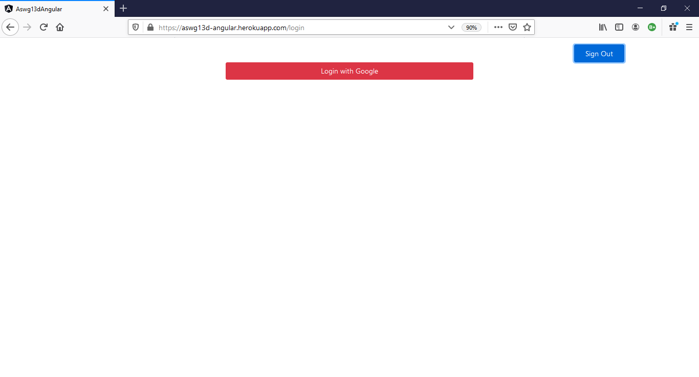
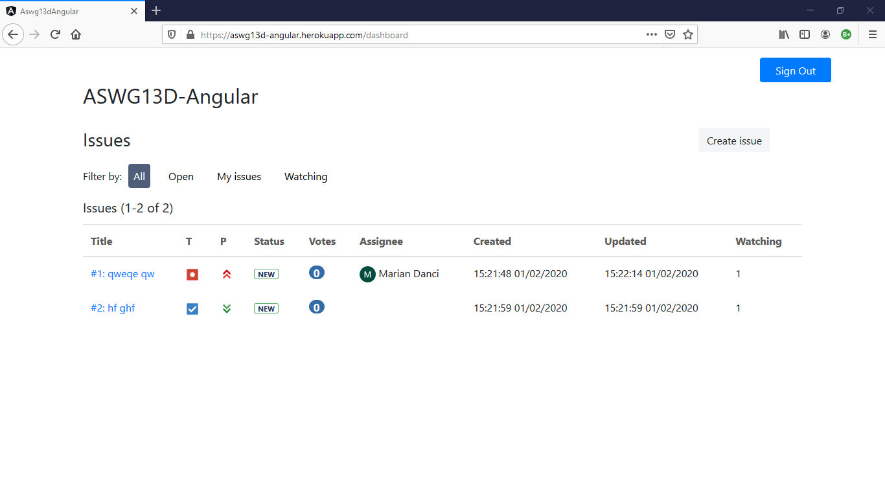
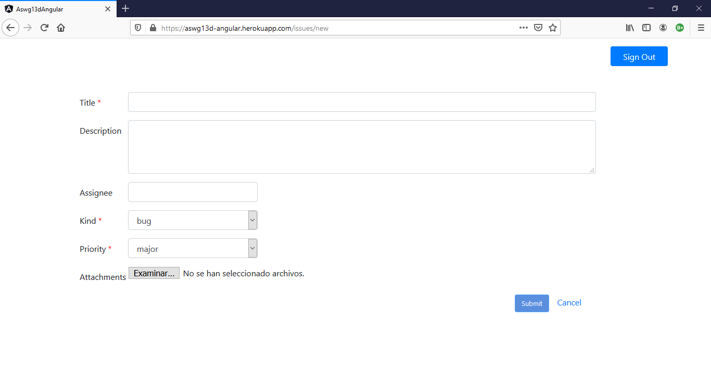
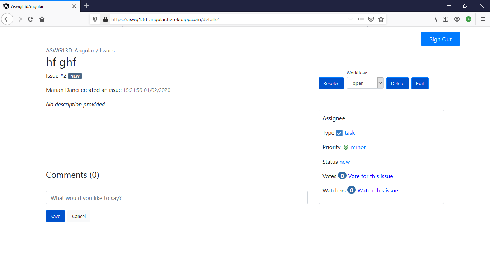
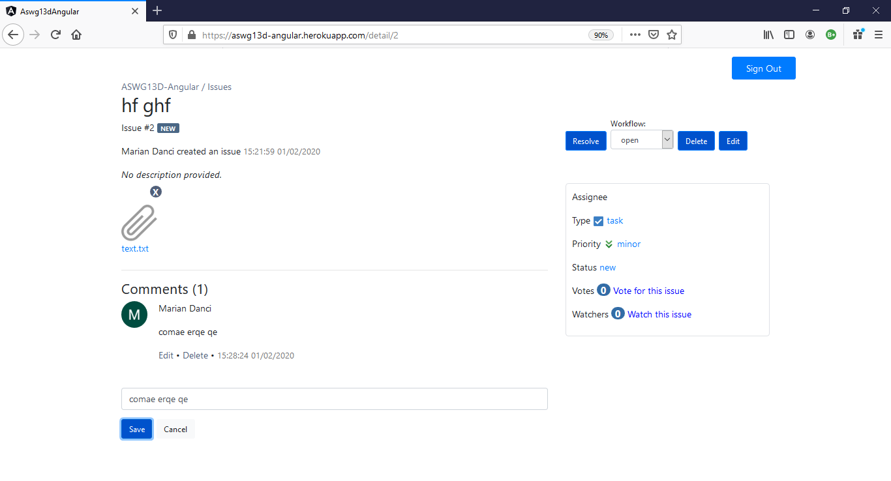
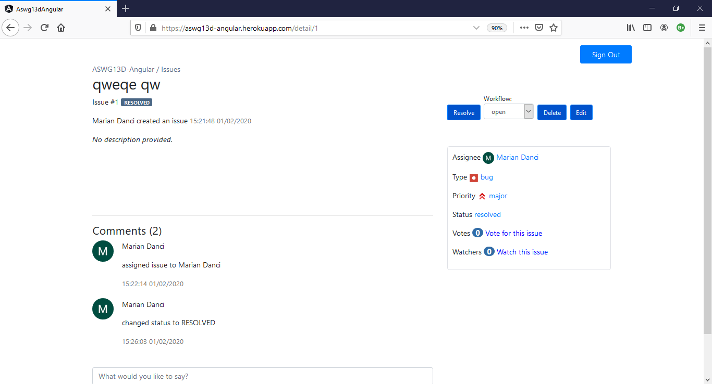
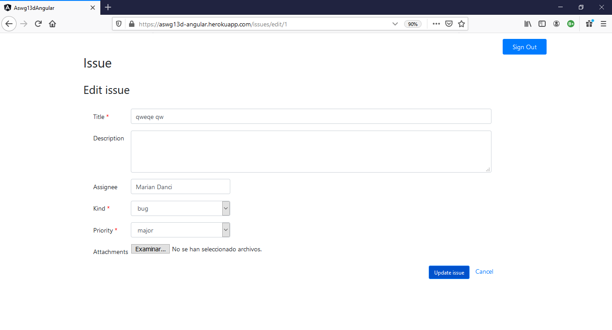

# REST API IssueTracker G13D 

A web app made it with Angular, based on the issue tracker of Bitbucket.

## Screenshots

#### Login

#### Issues

#### Create issue

#### Issue details

#### Edit issue details

## Authors
- Danci, Marian Dumitru
- Ait Fonollà, Adem

Link heroku:
https://aswg13d-angular.herokuapp.com

Link swagger:
https://grup13aswd-rest-api-blabla.herokuapp.com/api/swagger-ui.html